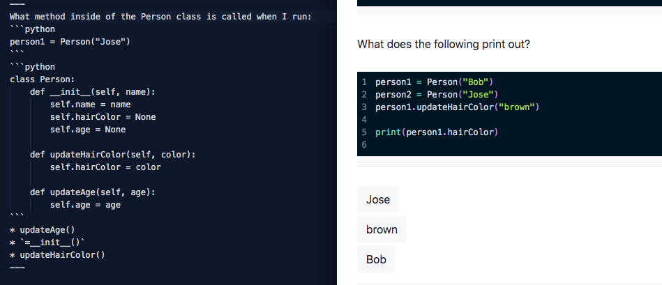

Much of computer science learning is spent trying to visualize different concepts. Teachers trying to tranfer visuals from their brain to the student. What if there was a way to provide quick and dynamic visuals which would reduce the friction within learning? I built a tool that allows one to write the format of an array or a graph within markdown that will be rendered as a webpage. 

Built in Next.js using mdx with jsx integrations.

It also converts any comments within code to a block on the side which can be hovered to highlight the line of code.

Quizes can easily made through markdown.